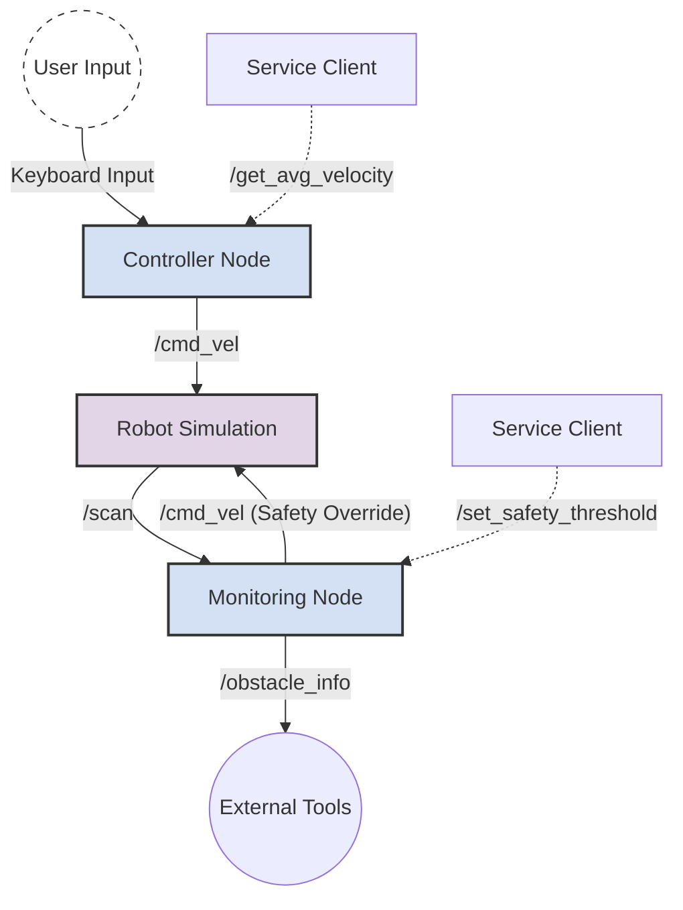

# Assignment 2 - Real-Time Robot Control (ROS 2), with 3D simulation using Gazebo

A ROS 2 package for controlling a robot in a simulation environment, featuring obstacle avoidance, velocity monitoring, and dual-language support (Python & C++).

## 📂 Project Structure

```text
assignment2_rt/
├── CMakeLists.txt              # Build configuration for C++ nodes and custom interfaces
├── package.xml                 # Package dependency and metadata definitions
├── launch/                     # Launch files
│   ├── project.launch.py       # Launches the Python implementation
│   └── project_cpp.launch.py   # Launches the C++ implementation
├── msg/                        # Custom Message definitions
│   └── ObstacleInfo.msg        # Custom message for published obstacle data
├── srv/                        # Custom Service definitions
│   ├── GetVelocity.srv         # Service to retrieve average velocity stats
│   └── SetThreshold.srv        # Service to dynamically set safety distance
├── scripts/                    # Python Source Code
│   ├── controller_node.py      # User interface node for driving the robot
│   └── monitoring_node.py      # Safety node using LaserScan data
└── src/                        # C++ Source Code
    ├── controller_node.cpp     # C++ Implementation of the controller
    └── monitoring_node.cpp     # C++ Implementation of the monitor
```

## 🏗️ Architecture

The system consists of two main nodes: the **Controller** and the **Monitor**. They interact with the robot simulation via topics and provide custom services.



### 🤖 Node Details

| Node Name | Description | Publishers | Subscribers | Services |
| :--- | :--- | :--- | :--- | :--- |
| **controller_node** | Handles user input to drive the robot. | `/cmd_vel` (`Twist`) | *None* | `get_avg_velocity` |
| **monitoring_node** | Monitors the laser scanner for obstacles. Stops the robot if too close. | `/cmd_vel` (`Twist`) <br> `/obstacle_info` (`ObstacleInfo`) | `/scan` (`LaserScan`) | `set_safety_threshold` |

---

## 🛠️ Installation & Build

1.  **Clone the repositories** into your ROS 2 workspace `src` folder:
    ```bash
    cd ~/ros2_ws/src
    git clone https://github.com/CarmineD8/bme_gazebo_sensors.git
    # Clone this package as well if not already present
    ```
2.  **Build the packages** using `colcon`:
    ```bash
    cd ~/ros2_ws
    colcon build
    ```
3.  **Source the workspace**:
    ```bash
    source install/setup.bash
    ```

---

## 🚀 Usage

This package provides implementations in both **Python** and **C++**. Both versions function similarly and include a dedicated terminal for status messages.

> **Note:** These instructions assume a working local installation of **Gazebo**. If you experience crashes or cannot run Gazebo locally, please verify your installation or skip to the **[Running with Docker](#-running-with-docker-alternative)** section below.

### Option 1: Running Python Nodes
Launches the Python scripts from the `scripts/` directory.

```bash
ros2 launch assignment2_rt project.launch.py
```

-   **Interface**: A terminal window will open asking for Linear (x) and Angular (z) velocities.
-   **Status Monitor**: A separate terminal will open displaying safety status ("OBSTACLE DETECTED" or "Safe Zone Detected").
-   **Simulation**: The Gazebo environment will launch alongside the terminals.

### Option 2: Running C++ Nodes
Launches the compiled C++ executables from the `src/` directory.

```bash
ros2 launch assignment2_rt project_cpp.launch.py
```

-   **Interface**: Same behavior as Python, utilizing the optimized C++ binaries.
-   **Status Monitor**: Opens the dedicated C++ monitoring terminal.
-   **Simulation**: The Gazebo environment will launch alongside the terminals.

### 🐳 Running with Docker (Alternative)

If Gazebo fails to launch or crashes on your local machine, you can use the provided Docker image to run the environment via VNC.

#### 1. Start Docker Container
First, start and enable the Docker service, then run the container:

```bash
sudo systemctl start docker
sudo systemctl enable docker
sudo docker run -p 6080:80 --shm-size=512m tiryoh/ros2-desktop-vnc:jazzy-20251019T1559
```

#### 2. Access the VNC Interface
Open your web browser and navigate to: http://127.0.0.1:6080/

#### 3. Setup Project Inside Docker
Once inside the VNC interface, open a terminal (System Tools -> LXTerminal) and set up the workspace:

```bash
# Create workspace directory
mkdir -p ~/ros2_ws/src
cd ~/ros2_ws/src

# Clone the required repositories
git clone https://github.com/CarmineD8/bme_gazebo_sensors.git
# Clone this assignment repository here as well (replace with your actual repo URL)
# git clone <repository_url> assignment2_rt

# Build the workspace
cd ~/ros2_ws
colcon build

# Source the workspace
source install/setup.bash
```

#### 4. Run the Nodes
Now you can proceed with **Option 1** or **Option 2** described above to launch the project within the Docker environment.

---

## 📡 Custom Interfaces

### Message: `ObstacleInfo.msg`
Used to publish detailed information about the closest obstacle.
-   `float32 distance`: Distance to the obstacle in meters.
-   `string direction`: Direction of the obstacle ("Front", "Left", "Right").
-   `float32 threshold`: Current safety threshold being applied.

### Service: `GetVelocity.srv`
**Request**: *Empty*
**Response**:
-   `float32 avg_linear`: Average linear velocity from the last 5 commands.
-   `float32 avg_angular`: Average angular velocity from the last 5 commands.

### Service: `SetThreshold.srv`
**Request**:
-   `float32 new_threshold`: The new safety distance limit.
**Response**:
-   `bool success`: Confirmation of the update.
